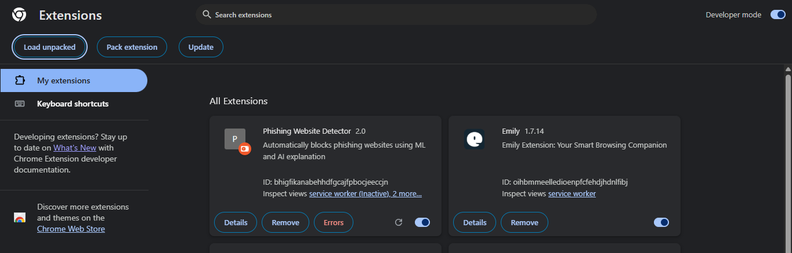

# 🛡️Phishing Website Detection System

## 📌 Overview

This project detects whether a website is **phishing or legitimate** using Machine Learning.
It combines a **frontend interface**, a **backend API**, and an **ML model**.

---

## 🚀 Features

* 🔍 URL-based phishing detection
* 🤖 Machine Learning model prediction
* 🌐 Web interface for user input
* ⚡ Fast API using Flask

---

## 🏗️ Project Structure

```
Phishing-Website-Detection/
│
├── phishing-frontend/   # UI (HTML, CSS, JS)
├── phishing-backend/    # Flask API
├── phishing-ml/         # ML model & training code
├── requirements.txt
└── README.md
```

---

## ⚙️ Tech Stack

* Frontend: HTML, CSS, JavaScript
* Backend: Python (Flask)
* ML: Scikit-learn, Pandas, NumPy

---

## 📂 Dataset

The dataset used for training is available here:
👉 (https://www.kaggle.com/datasets/jayendra0000/phishing-website-dataset)

---

## 🧠 ML Model

Download the trained model from here:
👉 https://www.kaggle.com/datasets/jayendra0000/ml-model

---

## ▶️ How to Run

### 1. Clone the repository

```
git clone https://github.com/Jayendra0000/Phishing-Website-Detection.git
cd Phishing-Website-Detection
```

### 2. Install dependencies

```
pip install -r requirements.txt
```

### 3. Run backend

```
cd phishing-backend
python app.py
```

### 4. Open frontend

Open `index.html` or load extension (if Chrome extension)

---

## 📸 Screenshots



---

## 👨‍💻 Author

Jaya Narendra Sai Maka

---

## ⭐ Acknowledgements

* Kaggle for dataset
* Open-source libraries
